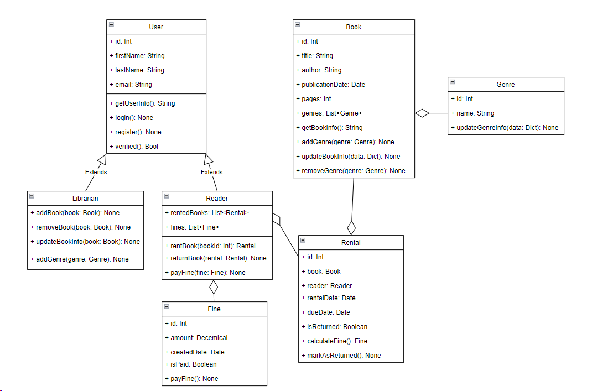

# Индустриальное программирование 2024

Студент группы ЭФМО-02-24: Васнев Илья Павлович

### Практическая работа 3
Тема работы: Проектирование системы для управления библиотекой

Схема представляет собой UML-классовую диаграмму системы управления библиотекой, которая включает следующие ключевые элементы:

1. **User (Пользователь)** – абстрактный класс с базовыми атрибутами и методами для всех пользователей системы (id, имя, фамилия, email). Имеет методы для регистрации и авторизации.
   - **Librarian (Библиотекарь)** – наследник User, управляет книгами: добавляет, удаляет, обновляет информацию о книгах и жанрах.
   - **Reader (Читатель)** – наследник User, взаимодействует с книгами: арендует, возвращает книги и оплачивает штрафы. Имеет список арендованных книг и штрафов.

2. **Book (Книга)** – класс, описывающий книгу (id, название, автор, дата публикации, количество страниц, список жанров). Методы позволяют добавлять и удалять жанры, обновлять информацию о книге.

3. **Genre (Жанр)** – класс, представляющий жанр книги с возможностью обновления информации.

4. **Rental (Аренда)** – описывает аренду книги (дата аренды, возврата, статус возврата). Методы позволяют отмечать возврат книги и рассчитывать штраф.

5. **Fine (Штраф)** – класс для штрафов за просроченные книги (сумма штрафа, дата, статус оплаты). Имеет метод для оплаты штрафа.

Диаграмма показывает отношения между этими классами:
- Наследование между User, Librarian и Reader.
- Агрегация между книгами, жанрами, арендой и штрафами.

